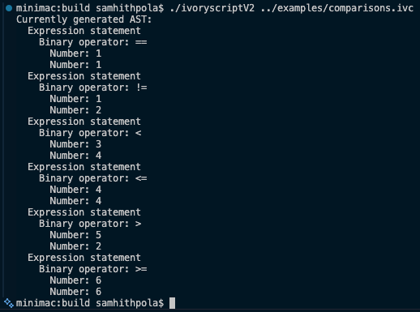
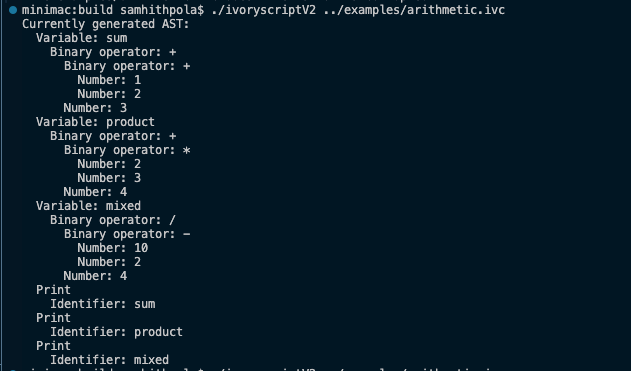

# IvoryScript

> **Note**: This project was submitted to the Macondo YSWS (you > > ship - we ship) program, which is part of [Hack Club](hackclub.> com).

> **Note**: This project is currently an AST generator, not a full compiler. See below for more information.

## The premise
IvoryScript is a compiled programming language that is made entirely in C++ and compiled with CMAKE. The choice to make this in C++ was purely based off my comfort in the language along with speed and performance reasons.

**The current version of IvoryScript is not complete.** What I mean to say by this is that while the ship itself is complete, the compiler does not currently execute bytecode and actually run your program, but rather prints a complete AST of your program.

All code that you write must adhere to the language's syntax and rules. To understand those in more depth, please refer to the `docs/specs` folder. If you want to check this out without writing your own programs, I left a few sample programs in the `examples` folder that are ready to run without any syntax errors.

## Compilation instructions:
If you would like to compile this yourself, this is the section that you are looking for. Otherwise, you can find a link to a GitHub release below with a precompiled macOS binary and instructions for using it. Keep in mind that you might need to make some small changes to CMake configurations if you are on an operating system other than macOS.

First, clone this repository using `git clone` or `gh clone` (GitHub CLI) and `cd` into the repository.

``` bash
git clone https://github.com/SamhithPola2025/IvoryScript-V2
cd IvoryScript-V2
```

Then, make a new build folder, `cd` into it, and run the following commands:

``` bash
mkdir build
cd build

cmake -B . -S ..
make
```

Now, you should have a nice binary executable called `ivoryscriptV2` in the `build` folder. You can look in the section below for instructions on how to use it.
If you had any trouble doing that, then the issue is with your build system or CMake being configured incorrectly, as the GitHub release is compiled with the same code, which has no current major bugs that would hinder compilation.

## Installation and instructions for use
To use IvoryScript, download the executable from [the GitHub releases page](https://github.com/SamhithPola2025/IvoryScript-V2/releases/tag/v1.0.0) and run it in your terminal with your second argument being any file, given it is in the IvoryScript file format, that you wish to run. An example is written below:

``./ivoryscriptV2 test.ivc``

You can also run IvoryScript in REPL (read-eval-print-loop) mode, which is, in a sense, a kind of interactive mode where you can type in normal IvoryScript code line by line and get an output.

Example:

```
./ivscript

IvoryScript 1.0.0. (Sun Aug 23 20:04:06 2026) REPL (read-eval-print-loop) mode.
Type "docs();" for more information. Type "exit();" to exit the REPL.

int a = 5;
if (a == 5) {
    print("hello world");
}

exit();

Currently generated AST:
  Exit
  Variable: a
    Number: 5
  If
    Condition:
      Binary operator: ==
        Identifier: a
        Number: 5
    Then:
      Print
        String: "hello world"
  Exit
```




